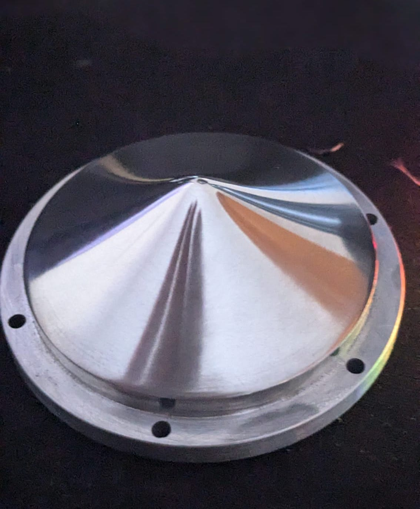
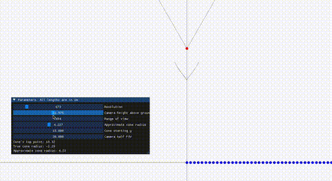

# The cone:

## What's the cone for?

Robots need to find the ball with the help of a camera. Many robots that simply place cameras in front of their robots need to make them spin until the ball enters the camera's field of vision, and can go towards it. This is a slow strategy. Instead of having the camera placed like this and having to spin slowly, many teams have found alternatives. The main alternatives are:
1. A camera with a fish-eye lens pointing down on the field.
2. Many cameras distributed around the robot.
3. A camera pointed up at a reflective cone.

Most teams go for the third option and so did we. A camera is pointing straight up from the center of the robot. A reflective cone (often cnc machined or created with a reflective film) is placed above it and lets the camera see an image of the field in the reflection. This lets the camera see in 360°.
We had an openmv h7 cam pointed at a cnc-machined aluminum cone.

## Why our cone is interesting
Many teams use hyperbolic mirors to have a view of the field. The cross section of the cone is hyperbolic. We decided to try something different. In the camera's view, using a hyperbolic mirror, the field is very distorted. Seeing this issue, we created a program that creates the perfect cone shape (cross section) for the view of the field to be a rectangle in the image given many inputs such as the camera's position, the cone's position and the field of view. The camera returns an image of the field similar to a photo being taken from far above the field. The value of such an image is that the distance between two points that 15 pixels on the image represents is equivalent to those same 15 pixels somewhere else in the image. We can measure distances in pixels between objects straight off the image, multiply it by a constant and get centimeters. This let us rely solely on the camera to go towards the ball, go towards the goal and avoid going out of bounds.

*The program has a GUI to let the user create the perfect cone shape based on the parameters. The red point is the camera. the whole image is a cross section of the field. the weirdly shaped line above the camera is the cross section of the cone. It outputs the stl file of the wanted cone when the program shuts.*

## What we would change for the 2026 competition
For next year, we will change many things around the cone:
1. The weight / size. The cone was rather large (6cm in diameter) and therefor raised the center of gravity (making strong accelerations lift a wheel off the ground. This is very negative as it means we lose some control over the robot's movement, and the vision system also breaks down due to measured distances not being valid at all when the robot isn't flat on the ground). Next year, we will create much smaller cones to avoid these issues and to reduce the price of the raw materials.
2. Although the program gave us the shape of the cone we wanted based on our inputted values, it turned out that a range of 1.5m isn't quite enough for the robot (we couldn't see the opponent's goal when we were in our half of the field for example). In other words, the system that gave us the cone worked well, but the values that we gave it will be changed for next year. Another solution to the issue of not seeing the opponent's goal is simply using a lidar (which is the plan for next year's robots) to know exactly where the robot is on the field with the camera only inputting which goal is the closest rather than finding the opponent's goal position.
